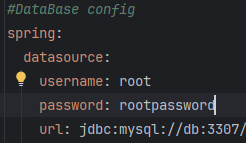

# SearchingMachine

## Описание проекта
Данный проект представляет из себя веб-приложение воплощающее поисковую систему. 
Для того чтобы осуществлять поиск по опеределенным сайтам был реализован механизм индексирования сайтов, а так же алгоритмы для поиска по пользовательскому запросу информации на проиндексированных сайтах.

## Изпользованные технологии
В проекте использовались такие технологии и библиотеки как:
 - Java 17
 - Spring Framework (version 2.7.1)
 - Apache Lucene
 - MySQL
 - Thymeleaf
 - Jsoup

## Установка и запуск
Есть 2 опции для установки и использования данного приложения: 
 - Docker (для запуска потребуется только Docker) 
 - Стандартный запуск приложения в IDE (потребуются IDE с Java 17 и БД MySQL)

Для того чтобы запустить приложение в Docker необходимо выполнить данные команды:
```
mvn clean build //сборка jar для последующей упаковки в контейнер
docker-compose up --build //сборка и запуск контейнеров
```
Для запуска приложения в IDE достаточно просто запустить проект как вы это делаете всегда :)

## Использование приложения
Использование приложения осуществляется с помощью веб-интерфейса. 
Для использования веб-интерфейса необхъодимо в браузере открыть страницу http://localhost:8080/
****
Стартовая страница - Dashboard - предоставляет информацию о сайтах указанных в application.yaml, о том проиндексированы они и или нет.
Так же отображается общая статистика сколько всего страниц и лемм (в сумме на всех сайтах)
<div style="text-align: center;">
    
</div>

****

На вкладке Management можно начать индексацию всех сайтов (указанных в application.yaml), а так же про/пере-индексировать отдельные страницы с сайтов. 
<div style="text-align: center;">
    
</div>

****

На вкладке Search, наконец-то, можно воспользоваться поиском. Поиск может осуществляться как по всем сайтам, так и только по конкретному. 

###### Note: В данный момент осуществлен только русскоязычный поиск

<div style="text-align: center;">
    
</div>

## Принцип работы приложения
Данное приложение - поисковая система. Для того чтобы осуществлять поиск по какому либо тексту, и уж тем более по сайту,
программе необходимо знать где искать(иначе поиск займет очень-очень... много времени). 
Для того чтобы поиск был максимально быстрым и четким программа выполняет данные шаги:
1) Добавляет в очередь на индексацию сайты из конфигурационного файла
2) При запуске индексации из веб-интерфейса начинается индексация сайтов
3) При индексакции программа находит все страницы на сайтах, а затем добавляет в БД всю необходимую информацию о страницах на сайтах
4) При осуществлении запроса на поиск(из веб-интерфейса) программа использует алгоритм для нахождения наиболее подходящих под запрос страниц, а затем выводит его пользователю 

## Настройка проекта под себя

Для использования данного проекта в своих нуждах, необходимо:
 - настроить БД для работы с приложением, сделать это можно создав БД в MySQL(или любой другой) 
и в "application.yaml" -> datasource указать параметры для доступа к БД.
<div style="text-align: center;">
    
</div>

 - добавить сайты для индексации в конфигурационный файл "application.yaml" -> indexing-settings -> sites
в необходимом формате
```
    - url: https://site.com/
      name: Site // может быть любой
```

## Статус проекта и его будущее
Проект был сделан в рамках обучения и практики. Возможно в будущем он будет дорабатываться и будут добавляться новые возможности. 
